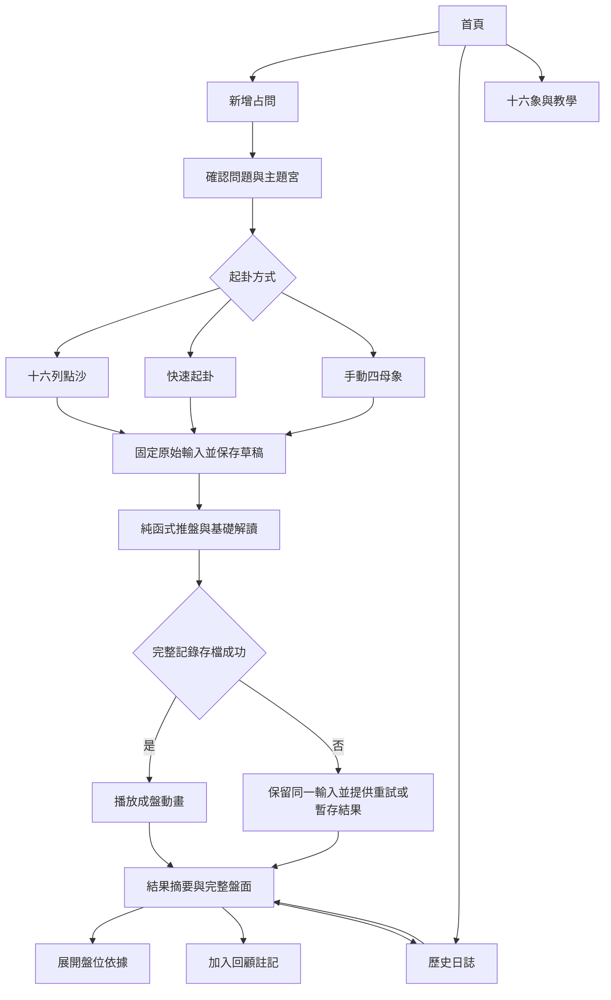
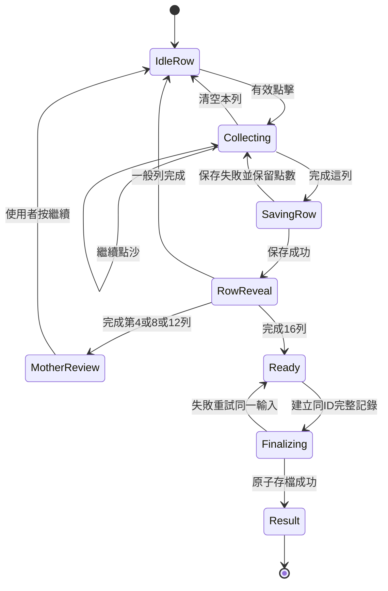

# 地占沙盤 MVP：產品與流程規格

版本 0.2.0 · 2026-09-30 · 對象：產品負責人、Codex、Claude Code、設計與測試人員

本文件取代前一份概念規劃中尚未確定的第一版實作選項。數學、資料欄位見 [ENGINE-AND-DATA](docs/ENGINE-AND-DATA.md)；技術實作見 [IMPLEMENTATION](docs/IMPLEMENTATION.md)；逐項驗收見 [ACCEPTANCE](docs/ACCEPTANCE.md)。遇到真正衝突，記入決策紀錄並說明；不要讓不同文件各自發展出不同規則。

## 1. 第一版要達成的結果

產品暫稱「地占沙盤」。主要使用者是繁體中文初學者。使用者不需懂十六象或占星術，也能提出一個問題、親手起卦、理解盤面從何而來，並留下可回顧的記錄。進階使用者可展開完整盾盤、十二宮與原始資料。

這裡的地占限定西方十六象系統。常見的取數方式是多列點痕的奇偶化約，再由四母象推導其他位置。App 不需要沙粒影像辨識、出生資料、星曆或 GPS。歷史背景、圖式變體與本案選擇見 [研究 G01–G05](docs/RESEARCH.md)。

第一版的解讀層級固定為 `basic-symbolic`：整體裁判主題、兩證人並列、第 1 宮、使用者選定的問題宮，以及明確標示的反思提示。沒有實作的成就技法，不可用文字假裝已經判斷。這是為了先驗證完整操作體驗，而非把所有流派一次塞入產品。

### 必做與延後

| 本輪必做 P0 | 後續候選 P1／P2 |
|---|---|
| 問題引導、三個主題、手動選擇問題宮 | AI 改寫問題、自動宮位推薦 |
| 十六列點沙、快速起卦、手動輸入四母 | 四次長按、滑沙取數、實體沙盤辨識 |
| 完整盾盤、調和者開關、十二宮列表 | 多流派、圓形宮盤、成就／相位／點之道 |
| 十六象說明、可展開依據的基礎解讀 | 專家審校後的深入判讀、AI 說明 |
| 本機日誌、註記、JSON 匯出匯入 | 帳號、跨裝置同步、圖片分享 |
| 響應式、鍵盤操作、減少動態效果、離線 | 原生 App 商店上架、付費與推播 |
| 本機試用回饋與手動匯出 | 後端分析平台、A/B 測試系統 |

不確定品牌與商業模式不會阻止第一版開工。用工作名稱與預設視覺完成試用後再決定。

## 2. 成功標準與非目標

試用對象先找 5–8 位初學者，另邀 1–2 位懂地占的人檢視術語與規則。初步目標：至少 80% 初學者在不代操作的情況下完成「提問→起卦→查看依據→找到日誌」；至少 4/5 能指出一項解讀來自哪個盤位。這些是小樣本改善門檻，不是正式統計推論。

要測的是完成率、操作感、可理解性、回顧價值。不要把使用者覺得「很準」直接當演算法正確性或預測效能證據。成效記錄與後續開發排序見 [PILOT](docs/PILOT.md)。

第一版無需後端、登入、API Key、付款、出生時間、個人定位。使用者問題與日誌只保存在使用者瀏覽器。不同裝置可以使用相同 App，但記錄須靠匯出／匯入轉移。

## 3. 整體使用流程

`暫存結果` 是明確標記的記憶體模式，沒有「已存入日誌」提示。它需要在本分頁保持開啟，可匯出、重試保存；關閉前會提醒未保存。失敗細節見第 11 節。

## 4. 資訊架構、路由與頁面

採 hash 路由，方便靜態主機與離線開啟。路由只含不可推測的本機 UUID；問題、卦象與個資不得放在 query string。

| 路由 | 主要內容 | 主要操作與離開條件 |
|---|---|---|
| `/#/` | 一句產品說明、開始按鈕、未完成草稿、最近 3 筆 | 新增、繼續草稿、日誌、教學 |
| `/#/new` | 問題、時間範圍、主題與問題宮、方法選擇 | 欄位有效才能開始；提交建立草稿 |
| `/#/cast/:id` | 問題摘要、方法對應操作、進度、暫停 | 全部來源固定後進入成盤；未完成可離開 |
| `/#/result/:id` | 摘要、證據、盾盤／十二宮、註記 | 展開依據、日誌、匯出此筆、新占問 |
| `/#/journal` | 本機列表、主題篩選、問題文字本機搜尋 | 開啟、刪除一筆、匯出選取記錄 |
| `/#/learn` | 起卦教學、十六象目錄、規則與來源 | 打開固定教學例題，永遠標示教學 |
| `/#/learn/:figureId` | 拉丁名、中文工作譯名、點陣、關鍵詞 | 返回；來源連結開新分頁 |
| `/#/settings` | 減少動畫、音效、資料管理、版本、回饋 | 匯入、全部匯出、清除、回饋匯出 |

未知路由回到有導航的「找不到頁面」。結果 ID 不存在顯示「這個瀏覽器找不到這筆記錄」，連到日誌，不要自動另起一盤。教學例題可用 `/#/learn/example`，優先於 `:figureId` 比對；不得混入真實占問日誌。

### 手機與桌面的配置

手機以單欄為主；結果先顯示摘要，再提供「解讀／盤面／筆記」三個頁籤。桌面結果可左右兩欄，左邊盤面、右邊解讀，仍使用同一資料。重要動作按鈕至少 44×44 CSS px，固定底部按鈕須避開安全區和軟鍵盤。

盾盤在手機不強塞八個可點的窄格：提供完整 SVG 概覽，另有「依位置瀏覽」的可操作列表。概覽可放大且有水平捲動提示，列表可直接展開同一盤位。不可僅靠 SVG 小圓點作為操作目標。

## 5. 提問流程

問題必填：去除首尾空白後至少 1 個字，最多 500 個 UTF-16 code units；輸入顯示剩餘字數，校驗採與程式相同標準。時間範圍選填，最多 80；可提供「未來一個月／三個月／自訂」快捷填入文字。不能要求「必須十字」而擋住正常問題。

| 主題 | 使用者要確認的宮位 | 引導例句 |
|---|---|---|
| 一般反思 | `null`，不指定問題宮 | 我面對這件事時，有哪些值得留意的條件？ |
| 工作 | 第 10 宮職位／發展；第 6 宮日常工作；第 7 宮合作／合約 | 未來三個月，我申請這個職位時有哪些助力與限制？ |
| 關係 | 第 7 宮伴侶／互動；第 5 宮戀愛／約會 | 我在這段關係的互動中，可以觀察與調整什麼？ |

工作／關係選擇後顯示單選卡；不替使用者默默決定。一般反思沒有問題宮卡。若主題改變，清掉不相容的宮位並要求重選。文字內容只原樣保存，不由規則引擎猜測另一宮；第一版無 NLP。

下方只放簡短說明：「請聚焦一件事。解讀提供象徵與反思，重要決定仍需實際資訊。」不加多頁強制聲明。按「開始起卦」後問題鎖定；要改問題，返回新占問並明確開始新的草稿，不能在舊盤上偷偷替換提問。

## 6. 十六列點沙：精確操作契約

### 使用者看見什麼

畫面依序顯示「第 1 母象／第 1 列」直到「第 4 母象／第 4 列」，外加 16 個進度格。沙盤提示：「在沙面上隨意點幾下，不用刻意計數；準備好後按完成這列。」不顯示即時數字、不顯示尚未確認的奇偶、不設定隱藏目標奇偶。

一個有效點擊代表一個有效點痕；周圍散開的小粒子僅是裝飾。使用者按「完成這列」後，先固定該列數量、寫入草稿，再以配對淡出動畫顯示奇數一點、偶數兩點。偶數的最後一對保留，不能全部消光再誤顯示零點。動畫可跳過；無論播放幾次不改資料。

一般列在化約動畫後進入下一列；第 4、8、12 列完成時顯示母象，停在母象回顧畫面並提供「繼續」。不提供已確認列的重抽按鈕。第十六列完成後自動進入成盤。中途可暫停，返回時從第一個未確認列開始；若恰好保存到第 4、8、12 列，先再次顯示母象回顧，再繼續，結果不變。

### 輸入判定，開發者不可自行猜測

| 事件／情境 | 決定 |
|---|---|
| primary `pointerdown` | 記住 pointerId、起點、時間；只畫暫時壓痕，不加計數 |
| 該 pointer 的 `pointerup` | 若從起點最大位移 ≤30 CSS px、時間 ≤1500 ms、放開仍在沙盤內，增加 1 點；清除候選 |
| `pointercancel`、失去 capture、頁面進背景 | 取消尚未提交的壓痕，不增加計數 |
| 第二隻手指／非主滑鼠鍵／筆的側鍵 | 忽略；不能把多指放開當兩點 |
| 拖動超過門檻、長按超過門檻、放開在外 | 不算點，沙盤可短顯「輕點即可」；不當作滑沙模式 |
| click | 指標路徑不得再用 click 加一次；避免瀏覽器合成事件造成雙算 |
| 鍵盤／輔助技術 | 另設原生 button「加入一點」，每次 activation 加 1；按住鍵的 repeat 不得連加 |
| 未滿 1 點就按完成 | 按鈕 disabled；文字提示先點沙；0 不得解讀為偶數 |
| 超過 4096 點 | 暫停加入，提示本列已達操作上限，可完成或清空；不自動完成、不回繞 |
| 尚未確認一列 | 可按「清空本列」重新開始；只作用當前列 |
| 已確認一列 | 不能修改；要重來必須明確放棄整個草稿 |

30 px（2026-10-01 由 12 px 放寬，見 DECISIONS D21）、1500 ms 與 4096 是本產品互動／防誤觸選擇，不是地占傳統。試用若發現可近用問題可調門檻，但必須版本化操作規格、補測試。採 Pointer Events 與 pointer capture；`touch-action: none` 只套用沙盤，不套整頁。頁面仍有正常捲動區。`pointercancel` 是瀏覽器正常情境，不能當成有效放開。[MDN](https://developer.mozilla.org/en-US/docs/Web/API/Element/pointercancel_event)

### 保存與恢復

每列按完成時，立刻設同步鎖，禁止新點擊及重複完成。寫入預期 `revision` 的草稿；成功後才進下一列並播放化約。失敗保持原列數量與畫面，重試使用同一個數量。禁止因錯誤而補抽亂數。

只保存已確認的列。頁面刷新後，尚未確認的當前列不恢復，回來顯示「已保留前 N 列；未確認的一列請重新點沙」。離開頁面時若當前列有點數，提供繼續或放棄本列的導航確認；關閉瀏覽器的提示只作輔助，不可假設一定觸發。

## 7. 快速與手動模式

**快速起卦**：畫面明確說「由裝置亂數產生四母象」。按一次按鈕，取得兩個位元組，依固定順序解析十六位元；立刻鎖住操作並保存。沙粒聚集動畫只揭示這個固定結果。亂數來自 `crypto.getRandomValues`，不以動畫幀數、時鐘、音量、壓力或 `Math.random` 代替。此方法是數位亂數取樣，不宣稱從實體沙或神祕訊號取得。[MDN](https://developer.mozilla.org/en-US/docs/Web/API/Crypto/getRandomValues)

若亂數 API 不可用，顯示無法使用快速模式，提供返回選擇手動或點沙；不得偷偷切換演算法。若保存失敗，在本分頁保留同一 `preparedSource`，重試不重新抽；重新整理後只可恢復已成功保存的來源。從未保存且從未揭示的來源遺失時，顯示未完成，需使用者再次明確啟動。

**手動輸入**：四張母象卡，每張四列；每列在 1 點與 2 點間切換。初始為未填，不用全二點假裝已完成。可選十六象名稱快速填滿單張，但保留圖式。全部 16 列已填後顯示預覽，按「依這四母象排盤」鎖定並保存。四母象可重複，甚至全部相同。不能套用抽牌不重複邏輯。標記來源「手動輸入」，不生成虛構原始點沙數。

手動模式尚未按確認的格子只在當前分頁保留；離開時提醒未保存，刷新後保留問題、重新輸入四母。按確認保存成功的 preparedSource 必須可恢復，不需再填，也不能被新值覆寫。

**自動點沙**（2026-10-01 新增，DECISIONS D22）：給不想自己點沙的人。按一次「開始自動點沙」，在按鈕 handler 內呼叫一次 `crypto.getRandomValues`，決定 16 列各落下 5–20 粒；立即保存為正式記錄，之後才在沙盤播放沙粒逐列落下、配對化約、每四列顯示母象的動畫。動畫的落點是裝飾，不是資料；可「略過動畫，看結果」，減少動態效果時直接顯示十六列與四母象。播放中重新整理，直接開啟已保存的結果。亂數不可用時與快速模式相同，提示改用其他方式。來源標記「自動點沙（裝置亂數）」，結果頁顯示每列由裝置亂數落下幾粒，不寫成使用者點的。

四種模式最後都只向相同的純函式提供四母象；後面的排盤與內容規則完全一致。

## 8. 盤面與動畫規格

數學完整定義在 [ENGINE-AND-DATA](docs/ENGINE-AND-DATA.md)。邏輯順序 `M1…M4,D1…D4,N1…N4,RW,LW,J,R`；傳統視覺上第一母位於右側。畫面不可把陣列 reverse 後直接存回資料。

| 動畫 | 初始設定 | 略過／減少動態效果 |
|---|---|---|
| 點沙落點 | 立即顯示小壓痕；裝飾粒子 150–250 ms | 直接顯示靜態點痕 |
| 一列奇偶化約 | 400–600 ms，很多點時分組淡出 | 直接顯示一點或兩點 |
| 四母到四女 | 300–450 ms，高亮對應行 | 直接顯示，保留說明按鈕 |
| 姪象、證人、裁判依序出現 | 全程成盤動畫合計 ≤3 秒 | 一次顯示所有位置 |
| 點擊依據 | 高亮來源 200 ms、焦點移到說明 | 靜態框線＋文字，不依賴顏色 |

Canvas 2D 用於沙粒；SVG＋HTML 用於盤面，無需 WebGL、3D 引擎或粒子套件。裝飾同時最多約 300 粒；高點數只聚合顯示，不截斷真實計數。動畫在背景分頁暫停，卸載清掉 requestAnimationFrame，DPR 上限 2，避免高解析手機耗電。

點擊裁判展示 `RW + LW → J` 的逐行合成；點女象展示轉置而不是相加；點母象時，點沙模式可展開實際原始數量，快速模式顯示「數位亂數來源」，手動模式顯示「手動設定」。不可讓三種模式都出現假想的十六列點沙。

預設調和者收合，切換只改顯示。十二宮先用有標號的 12 張卡，不必在 MVP 重現占星圓盤。卡上含宮名、來源盤位、象名與圖式；選定問題宮和第 1 宮用框線與文字標示。

## 9. 解讀頁如何呈現

結果頂部顯示問題、建立日期、來源方式與「基礎象徵解讀・內容草稿」。展開說明交代尚未包含成就關係與完整傳統斷事，不需每張卡重複長篇聲明。

解讀卡固定順序：①整體觀察主題 ②兩個證人的並列觀察 ③自己的處境 ④問題所屬範圍（一般反思省略）⑤可以記下的下一步。每張卡都有「查看依據」：列出對應盤位、象名、圖式、規則 ID 的人類可讀名稱與來源頁。技術版本 ID 放在進階資訊，不打斷一般閱讀。

證人第一版只並列象徵；不擅自稱右為過去、左為未來，不把兩者直接判成好壞抵消。第 1 宮與問題宮亦只做範圍配對，沒有成就技法就不顯示「會成功／不會成功」或成功百分比。

反思提示標示「反思提示」，來源為本產品原創編輯；它可以協助寫下一步，但不冒充歷史文獻逐字判詞。不同問題若主題、宮位和盤相同，基礎解讀可能一樣；不透過套入使用者文字造成假個人化。

正式上線前的內容審校需要逐條記錄審核者、日期、來源與修改理由。私人試用可以使用現有草稿。內容更新不得回頭覆蓋已保存的當時解讀，詳見資料契約。

## 10. 日誌、資料與回饋

成功產生結果就自動存入本機日誌，按鈕叫「寫下回顧」，不再用「儲存」讓人誤以為結果尚未存。註記最多 5000 code units，明確按「保存筆記」後顯示成功；失敗保留文字。記錄原始問題不可直接改寫；需要新的問題用新占問。

列表按建立時間倒序，可用主題篩選與問題文字搜尋；全部在本機執行。刪除一筆前簡短確認，刪後若重新訪問該 ID 顯示不存在。資料管理的「清除全部」需輸入「清除」才執行，不影響 App 靜態快取以外的其他網站。

匯出含已選記錄的 UTF-8 JSON，可完整備份問題、盤、當時解讀與筆記；下載前明確提示檔案包含私人文字。第一版不做公開分享連結。匯入先檢查大小、結構、規則版本與盤面一致性，顯示可匯入／重複／不支援／無效清單，使用者確認後才入庫。不覆蓋既有記錄。[資料契約與衝突處理](docs/ENGINE-AND-DATA.md)

不支援版本的只讀封存放在「設定→資料管理→封存檔」，可查看純文字預覽、下載原檔、刪除。不要混入一般解讀日誌；它不保證符合目前的排盤規則。

回饋與日誌分開。使用者可在設定啟用「記錄本機試用流程」，再以 JSON 手動交給測試主持人。預設不開啟、不上傳、不收問題／筆記／盤面。詳見 [PILOT](docs/PILOT.md)。

## 11. 失敗、重入與離線情境

| 情境 | 畫面與行為 | 絕對不能做 |
|---|---|---|
| 列確認時寫入失敗 | 留在原列、保留點數、提供重試 | 宣稱已保存或自動再取數 |
| 完整結果寫入失敗 | 保留同一來源；重試、匯出或明確進暫存結果 | 重抽、增加第二筆同 ID 記錄 |
| 雙擊完成／快速按鈕 | 同步操作鎖；僅一個有效提交 | 只用事後 debounce 假裝防重 |
| 同草稿兩分頁 | 以 revision 比對；較舊頁提示重新載入最新草稿 | 靜默 last-write-wins 覆寫 |
| 重新整理已完成結果 | 直接讀當時記錄、圖與文字 | 在 mount/effect 中再取亂數 |
| 未知內容／規則版本 | 受限制的純文字歷史檢視，不重新解讀 | 用新規則強制換算舊記錄 |
| 已知規則但盤與來源不合 | 匯入拒絕；本機記錄隔離並可匯出原始資料 | 修掉來源後假裝原本正確 |
| IndexedDB 無法開啟 | 提示暫存模式；使用者接受後可體驗、匯出 | 說記錄能跨重啟保留 |
| 斷網 | 已快取者能完成核心流程；外部來源頁提示需網路 | 在解讀時依賴遠端文字或字型 |
| 新版本下載完成 | 非起卦中才提示更新；先處理草稿 | 強制重載進行中的沙盤 |
| 瀏覽器清除網站資料 | 本機記錄會消失，依備份匯入恢復 | 承諾永久保存或雲端備份 |

瀏覽器資料可能被清除或受配額限制；可請求持久儲存但仍提供匯出。不能把 `navigator.storage.persist()` 的回傳值當永久保證。[MDN 儲存說明](https://developer.mozilla.org/en-US/docs/Web/API/Storage_API/Storage_quotas_and_eviction_criteria)

## 12. 視覺與可近用初始設定

採安靜、溫暖的沙盤風格。初始色票：背景 `#F4EBDC`、卡面 `#FFF9F0`、文字 `#28231E`、深色強調 `#725021`；開發時實测對比，文字不放在細碎沙紋上。使用系統中文字型，標題和正文皆以可讀性優先，不依賴線上字型。

結果的核心文字維持 16 px 以上；可放大到 200% 而不遮住主要功能。手機 360 px 寬與桌面 1440 px 寬皆驗收。音效預設關閉，使用者手動開啟後才可播放，瀏覽器拒絕音訊不得影響流程。震動不列為 P0，不以它作必要回饋。

遵從 `prefers-reduced-motion`；設定可選「跟隨系統／減少／完整」。沙盤有鍵盤替代，SVG 有文字列表與 aria-label；讀屏不逐粒播報，僅播報列完成和當前進度。Modal 關閉回到原觸發按鈕，錯誤文字與輸入關聯，不能只有紅色框線。

## 13. 第一版的完成定義

完成代表：三種來源可產生正確盤與基礎解讀；點沙流程可中斷恢復；成功結果可重開、註記、匯出匯入；離線可啟動；手機與桌面有實際操作證據；重大資料／手勢錯誤已修復；試用腳本與尚未驗證事項已交代。

如果開發代理沒有 iPhone 或 Android 真機，要完成能做的建置和瀏覽器測試，交付預覽與真機檢查表，並清楚標「待驗證」。桌面模擬不能宣稱完成手機 PWA 真機驗收。對外公開部署不是本交接包已完成事項；先交本機預覽與可部署 `dist/`，由使用者決定試用網址。

開發順序與實際完成狀態分別以 [TASKS](TASKS.md) 與 [STATUS](STATUS.md) 為準。
