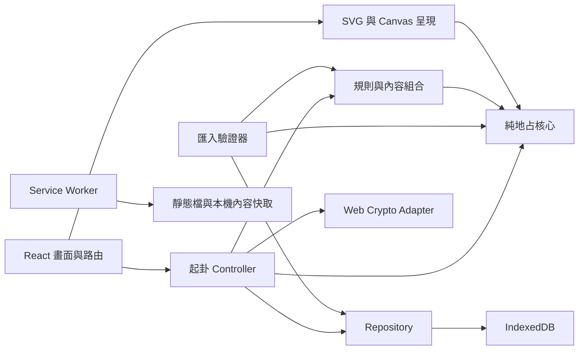
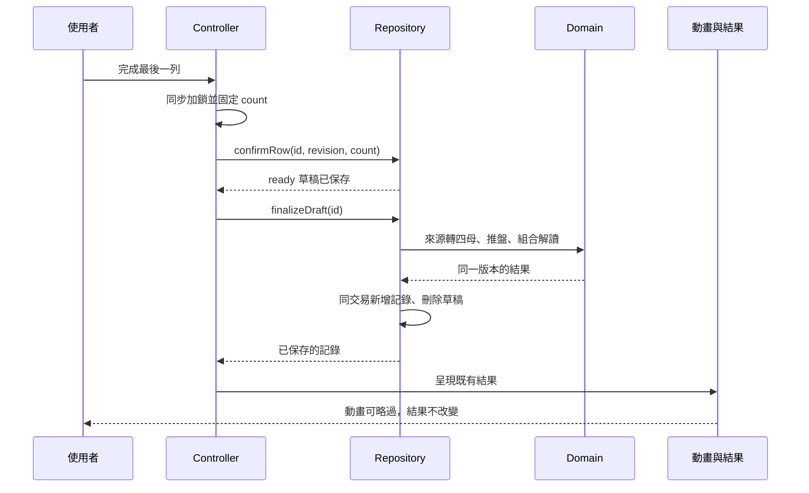

# 技術架構與實作約束

## 1. 技術選擇

本版採 React＋TypeScript＋Vite 的單頁 PWA。這是基於本案「本機運算、少量路由、離線、不需伺服器資料」的選擇；沒有必要先導入全端框架、帳號服務或大型狀態管理。

| 層 | 選擇 | 原因／邊界 |
|---|---|---|
| UI | React＋TypeScript，CSS variables／CSS modules | 共用手機與桌面元件；可維持小型專案 |
| 建置 | Vite＋官方 React plugin | 靜態輸出；開發快速預覽 |
| 導航 | React Router HashRouter | 靜態主機不需每條路由改寫 |
| 起卦控制 | 純 reducer＋明確 actions＋少量 controller | 把手勢、保存與動畫狀態分清楚 |
| 沙粒／盤面 | Canvas 2D／SVG＋HTML | 不需要 WebGL；盤面有文字替代 |
| 本機儲存 | IndexedDB，採 `idb` promise wrapper | 跨 store 原子交易，避開 localStorage 容量與同步操作 |
| 輸入邊界 | Zod 或等效手寫嚴格 schema | 對匯入 JSON、草稿、歷史記錄做 runtime validation |
| 離線 | `vite-plugin-pwa`，Workbox generateSW，提示更新模式 | 快取 app shell、所有本機內容；不強制中途重載 |
| 測試 | 現有 Node 測試＋Vitest／Testing Library＋Playwright | 核心、controller／儲存、真實瀏覽器流程分層 |

參考各專案官方文件：[Vite](https://vite.dev/guide/)、[React](https://react.dev/learn/creating-a-react-app)、[HashRouter](https://reactrouter.com/api/declarative-routers/HashRouter)、[idb](https://github.com/jakearchibald/idb)、[Zod](https://zod.dev/)、[Vite PWA](https://vite-pwa-org.netlify.app/guide/)、[Vitest](https://vitest.dev/guide/)、[Playwright](https://playwright.dev/docs/intro)。

開始實作時確認彼此相容的穩定版本，記在 `package.json` 並提交 lockfile；後續用 `npm ci` 重現。不要把本文件查閱時的「latest」當永久固定版本，也不要無原因升級整包依賴。執行環境採 Node 24.12 以上，現有參考核心在 Node 24.19.0 跑過。

## 2. 模組與依賴方向



核心 domain 不 import React、Canvas、IndexedDB、日期或亂數。動畫只讀盤面快照；它不能回傳新的四母象。Controller 擁有狀態切換與冪等性，Repository 擁有交易與版本衝突處理，解讀引擎只使用合法四母與內容版本。

### 預期目錄

```text
AGENTS.md / CLAUDE.md / START-PROMPT.md / STATUS.md / TASKS.md
docs/                         規格、驗收、來源、試用文件
fixtures/teaching.json         固定例題
src/
  domain/                     已提供核心、圖式、解讀、資料介面
  app/                        Router、App、全域 ErrorBoundary
  features/
    question/                 問題與宮位表單
    casting/                  reducer、controller、三種起卦入口
    result/                   摘要、依據、盤位詳情
    journal/                  列表、筆記、搜尋、刪除
    learn/                    十六象與教學
    settings/                 資料管理、動態效果、回饋
  components/                 FigureGlyph、ShieldChart、HouseList、Dialog
  infrastructure/
    db.ts                     DB schema／upgrade
    repository.ts             交易 API
    importExport.ts           邊界校驗、預覽、備份
    feedback.ts               本機事件與回饋
  styles/                     色票、間距、可近用與響應式
  main.tsx
public/                       自製圖示、離線所需本地資產
tests/
  core.test.mjs               現有 Node 完整枚舉
  demo.mjs
  unit/                      reducer／validator 等新增測試
  e2e/                       Playwright
index.html / vite.config.ts / tsconfig*.json
```

新代理直接擴充此目錄；不要把 Vite template 無差別覆蓋 `src/domain`、package scripts 或文件。若先用臨時目錄產生模板，只搬入必要設定。根目錄維持單一 package，不需要 monorepo。

## 3. TypeScript 與測試命令

既有 domain 使用 `.ts` 副檔名 import，方便 Node 原生執行。Vite／TS 設定使用 `moduleResolution:'bundler'`、`noEmit:true`、`allowImportingTsExtensions:true`，以實際安裝版 TypeScript 校驗。程式不使用需轉譯的 enum／parameter properties。若開啟更嚴格索引檢查，先修型別，不應停用 strict 掩蓋問題。

M0–M5 已建立以下命令；實際執行結果見 `STATUS.md`：

```text
npm run dev          Vite 開發伺服器
npm run typecheck    tsc --noEmit，或對等 project 設定
npm run lint         ESLint，含 React hooks 規則
npm run test:core    現有 Node 核心測試
npm run test:unit    Vitest run，只包含 tests/unit
npm run test:e2e     Playwright test
npm run build        型別檢查後產生 dist
npm run preview      預覽 production build
```

Vitest 不要自動收進 Node 的 `.test.mjs`；兩種 runner 各跑自己的目錄。測試共用教學 fixture，不複製另一份可能不同的期望結果。

端到端測試專用預覽為 `http://localhost:4183/`，每次重新建置，`reuseExistingServer: false`；連接埠被佔用時中止，不能借用不明版本的預覽。一般手動 `npm run preview` 保持 4173。Windows PowerShell 若限制 `.ps1`，改用 `npm.cmd`／`npx.cmd` 執行。

## 4. 操作與交易的先後順序



禁止由動畫結束才算卦；不得用 `setTimeout` 決定最終取數。React StrictMode 可能重複執行開發期流程，起卦不得放在 effect。快速按鈕同步 lock 比 React setState 更新更早建立；資料庫層仍須保護同 ID 冪等性，不能只信 UI。

頁面載入時：先開 DB→讀路由 ID→優先找完整記錄→再找草稿。若是 ready 草稿，可重試 finalization，會回傳同 ID 已有結果；普通草稿恢復進度。讀取不支援版本時進只讀 archive 流程。

## 5. 離線、安裝與更新

Manifest：`name='地占沙盤'`、`short_name='地占沙盤'`、`display='standalone'`、`lang='zh-Hant'`，start_url 與 scope 配合部署 base。提供 192／512 px 圖示及 maskable 版本，來源自製。所有 P0 頁面、內容表、圖示皆在本機打包；不從 CDN 載入必要程式、字型或解讀。

使用 prompt 更新流程；若使用者正在點沙或有未保存筆記，延後套用新 worker。更新只在使用者接受後進行，先確認草稿已落盤。避免在安裝 worker 時自動 `skipWaiting`＋重載所有分頁。每個部署保持同一 origin，改網域會得到另一個本機資料庫。

第一次線上載入不代表立刻離線就可用。必須等待 precache 成功與 service worker 控制頁面後，才顯示「已可離線使用」；失敗提供重試而非綠色成功標籤。測試以 production build 執行，不能只用 Vite dev 判斷離線成功。

Service worker 需要安全來源。桌面 `http://localhost` 可用於開發；手機開 `http://192.168.x.x:5173` 不等同手機自己的 localhost，不能據此完成 PWA 驗收。手機安裝與離線要用可信任 HTTPS 測試網址或正確配置的本地 HTTPS。[MDN Service Worker](https://developer.mozilla.org/en-US/docs/Web/API/Service_Worker_API)

安裝入口依能力顯示：支援瀏覽器事件者提供安裝按鈕；iOS 顯示加入主畫面的操作說明。沒有安裝支援也可用一般瀏覽器完成流程，不把安裝當開始占問的門檻。

## 6. 效能與日常維護

首頁初始 JS 的 gzip 目標 ≤250 KiB，不把測試資料、整份研究文件、第三方教材或大量音效打入入口。超標先查 bundle 原因，記錄理由；這是工程目標，無需為幾 KB 引入複雜分包。

中階手機點沙盡量維持順暢：裝飾粒子 300 上限、動畫迴圈只在需要時啟動、Canvas DPR≤2；控制器數據與 canvas位置分開。一次性成盤純函式很小，不需 Web Worker。畫面縮放時重繪既有狀態，不重建起卦來源。

首次遷移 DB 要處理 `blocked`／`versionchange`：提示其他分頁關閉，關閉舊連線，不刪資料強制解決。服務 worker 更新與 DB 升級是不同生命週期；不要假設兩者同時完成。

## 7. 隱私與交付方式

P0 無第三方追蹤、無後端上傳、無 API Key。一般靜態主機仍可能有存取紀錄，但 URL 不含問題或結果資料。外部來源連結標明需連線；不得把問題文字附在來源連結後。

測試不要使用真實私密問題；fixture 使用公開的教學句。錯誤上報若未來加入，必須先定義可收集欄位，不能順手把 state dump 傳出去。

交付時提供本機執行指令、`dist/` 建置方式、實際測試結果、手機測試清單與尚未完成事項。第一版不需要自動購買網域或部署到公開服務。若使用者之後指定主機，就按該主機文件部署，保持資料來源與權限範圍清楚。
